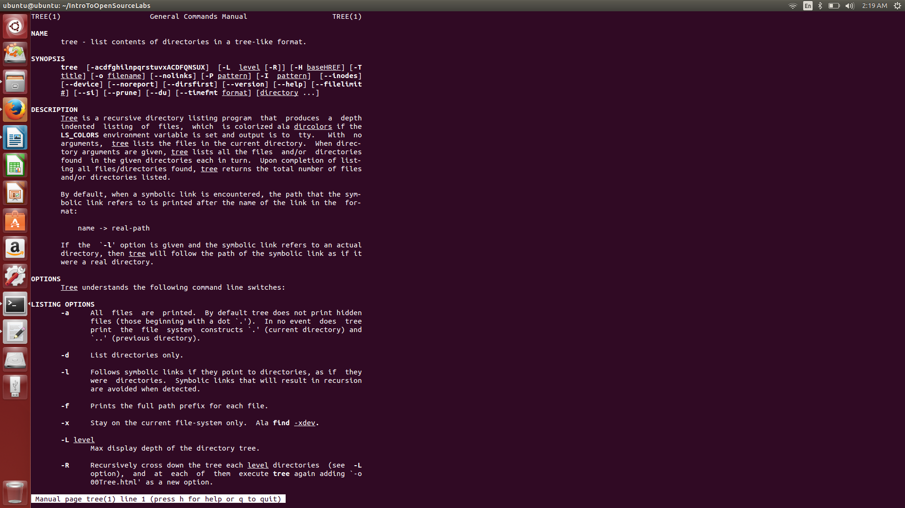

Put yourself in their position in order to better understand the reason they asked the question and help them answer that.

Try and forsee the future questions that they might come up with and if they might encounter impossible tasks with their current method. Suggest what they can do currently and where they may encounter trouble down the line and what they may be able to do about it.

It would seem that the RPI student was totally justified in what he did but the large company needed to make a point and discourage other people from doing the same. This was a clear cut case of might makes right, might being financial might. RITT was proving a point to other entreapueners who may be considering doing something similar to the RPI student. Even though those students might not be intending to create a program that interacted with their "stuff" it doesnt matter. If they violate the terms that the company set they are still liable no matter if they themselves doing anything wrong. Much like how if someone were to violate liscensing terms on your software you could do something 

photo of man page tree:
	
